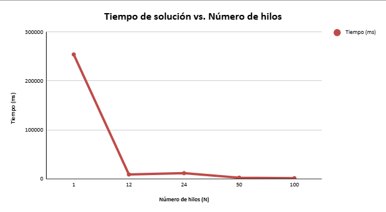

### Escuela Colombiana de Ingeniería
### Arquitecturas de Software - ARSW

### Andres Sabogal - Marco Alvarez

## Ejercicio Introducción al paralelismo - Hilos - Caso BlackListSearch

### Dependencias:
####   Lecturas:
*  [Threads in Java](http://beginnersbook.com/2013/03/java-threads/)  (Hasta 'Ending Threads')
*  [Threads vs Processes]( http://cs-fundamentals.com/tech-interview/java/differences-between-thread-and-process-in-java.php)

### Descripción
  Este ejercicio contiene una introducción a la programación con hilos en Java, además de la aplicación a un caso concreto.
  

**Parte I - Introducción a Hilos en Java**

1. De acuerdo con lo revisado en las lecturas, complete las clases CountThread, para que las mismas definan el ciclo de vida de un hilo que imprima por pantalla los números entre A y B.
2. Complete el método __main__ de la clase CountMainThreads para que:
	1. Cree 3 hilos de tipo CountThread, asignándole al primero el intervalo [0..99], al segundo [99..199], y al tercero [200..299].
	2. Inicie los tres hilos con 'start()'.
	3. Ejecute y revise la salida por pantalla. 
	4. Cambie el incio con 'start()' por 'run()'. Cómo cambia la salida?, por qué?.

- Con start() los numeros de los tres rangos salen mezclados y sin ningun orden (cambia en casda ejecucion). Esto es porque start() crea un hilo nuevo y el sistema reparte el tiempo de CPU entre los tres hilos, alternando su ejecucion.

- Con run() los numeros salen en orden secuencial uno por uno; primero sale todo el rango del hilo 1, luego el hilo 2, y finalemente el hilo 3, sin mezclarse. Esto es porque run() es solo un metodo normal que no crea ningun hilo nuevo, entonces se ejecuta directamente en el hilo main y cada llamada debe terminar antes de que empiece la siguiente.

**Parte II - Ejercicio Black List Search**

Para un software de vigilancia automática de seguridad informática se está desarrollando un componente encargado de validar las direcciones IP en varios miles de listas negras (de host maliciosos) conocidas, y reportar aquellas que existan en al menos cinco de dichas listas. 

Dicho componente está diseñado de acuerdo con el siguiente diagrama, donde:

- HostBlackListsDataSourceFacade es una clase que ofrece una 'fachada' para realizar consultas en cualquiera de las N listas negras registradas (método 'isInBlacklistServer'), y que permite también hacer un reporte a una base de datos local de cuando una dirección IP se considera peligrosa. Esta clase NO ES MODIFICABLE, pero se sabe que es 'Thread-Safe'.

- HostBlackListsValidator es una clase que ofrece el método 'checkHost', el cual, a través de la clase 'HostBlackListDataSourceFacade', valida en cada una de las listas negras un host determinado. En dicho método está considerada la política de que al encontrarse un HOST en al menos cinco listas negras, el mismo será registrado como 'no confiable', o como 'confiable' en caso contrario. Adicionalmente, retornará la lista de los números de las 'listas negras' en donde se encontró registrado el HOST.

Al usarse el módulo, la evidencia de que se hizo el registro como 'confiable' o 'no confiable' se dá por lo mensajes de LOGs:

INFO: HOST 205.24.34.55 Reported as trustworthy

INFO: HOST 205.24.34.55 Reported as NOT trustworthy

Al programa de prueba provisto (Main), le toma sólo algunos segundos análizar y reportar la dirección provista (200.24.34.55), ya que la misma está registrada más de cinco veces en los primeros servidores, por lo que no requiere recorrerlos todos. Sin embargo, hacer la búsqueda en casos donde NO hay reportes, o donde los mismos están dispersos en las miles de listas negras, toma bastante tiempo.

Éste, como cualquier método de búsqueda, puede verse como un problema [vergonzosamente paralelo](https://en.wikipedia.org/wiki/Embarrassingly_parallel), ya que no existen dependencias entre una partición del problema y otra.

Para 'refactorizar' este código, y hacer que explote la capacidad multi-núcleo de la CPU del equipo, realice lo siguiente:

1. Cree una clase de tipo Thread que represente el ciclo de vida de un hilo que haga la búsqueda de un segmento del conjunto de servidores disponibles. Agregue a dicha clase un método que permita 'preguntarle' a las instancias del mismo (los hilos) cuantas ocurrencias de servidores maliciosos ha encontrado o encontró.

2. Agregue al método 'checkHost' un parámetro entero N, correspondiente al número de hilos entre los que se va a realizar la búsqueda (recuerde tener en cuenta si N es par o impar!). Modifique el código de este método para que divida el espacio de búsqueda entre las N partes indicadas, y paralelice la búsqueda a través de N hilos. Haga que dicha función espere hasta que los N hilos terminen de resolver su respectivo sub-problema, agregue las ocurrencias encontradas por cada hilo a la lista que retorna el método, y entonces calcule (sumando el total de ocurrencuas encontradas por cada hilo) si el número de ocurrencias es mayor o igual a _BLACK_LIST_ALARM_COUNT_. Si se da este caso, al final se DEBE reportar el host como confiable o no confiable, y mostrar el listado con los números de las listas negras respectivas. Para lograr este comportamiento de 'espera' revise el método [join](https://docs.oracle.com/javase/tutorial/essential/concurrency/join.html) del API de concurrencia de Java. Tenga también en cuenta:

	* Dentro del método checkHost Se debe mantener el LOG que informa, antes de retornar el resultado, el número de listas negras revisadas VS. el número de listas negras total (línea 60). Se debe garantizar que dicha información sea verídica bajo el nuevo esquema de procesamiento en paralelo planteado.

	* Se sabe que el HOST 202.24.34.55 está reportado en listas negras de una forma más dispersa, y que el host 212.24.24.55 NO está en ninguna lista negra.

**Parte II.I Para discutir la próxima clase (NO para implementar aún)**

La estrategia de paralelismo antes implementada es ineficiente en ciertos casos, pues la búsqueda se sigue realizando aún cuando los N hilos (en su conjunto) ya hayan encontrado el número mínimo de ocurrencias requeridas para reportar al servidor como malicioso. Cómo se podría modificar la implementación para minimizar el número de consultas en estos casos?, qué elemento nuevo traería esto al problema?

**Parte III - Evaluación de Desempeño**

A partir de lo anterior, implemente la siguiente secuencia de experimentos para realizar las validación de direcciones IP dispersas (por ejemplo 202.24.34.55), tomando los tiempos de ejecución de los mismos (asegúrese de hacerlos en la misma máquina):

1. Un solo hilo.
2. Tantos hilos como núcleos de procesamiento (haga que el programa determine esto haciendo uso del [API Runtime](https://docs.oracle.com/javase/7/docs/api/java/lang/Runtime.html)).
3. Tantos hilos como el doble de núcleos de procesamiento.
4. 50 hilos.
5. 100 hilos.

Al iniciar el programa ejecute el monitor jVisualVM, y a medida que corran las pruebas, revise y anote el consumo de CPU y de memoria en cada caso. 

Con lo anterior, y con los tiempos de ejecución dados, haga una gráfica de tiempo de solución vs. número de hilos. Analice y plantee hipótesis con su compañero para las siguientes preguntas (puede tener en cuenta lo reportado por jVisualVM):

## Parte III - Evaluación de Desempeño

### Entorno de pruebas
- Host analizado: 202.24.34.55 (IP dispersa en las listas negras)
- Núcleos detectados: 12 (usando `Runtime.getRuntime().availableProcessors()`)
- Todas las pruebas se corrieron en la misma máquina, una tras otra.

### Tabla de resultados

| N (hilos) | Descripción         | Tiempo (ms) | Tiempo (s) |
|-----------|----------------------|-------------|------------|
| 1         | 1 solo hilo           | 254,064.99  | 254.06     |
| 12        | Núcleos disponibles   | 8,727.25    | 8.73       |
| 24        | 2 x núcleos           | 11,383.26   | 11.38      |
| 50        | 50 hilos              | 2,141.11    | 2.14       |
| 100       | 100 hilos             | 1,104.70    | 1.10       |

### Gráfica: Tiempo vs. Número de hilos

### Lo que se vio en jVisualVM

El CPU se mantuvo bajo durante toda la prueba, sin picos altos, y la memoria
se mantuvo estable alrededor de 250 MB. Esto tiene sentido porque cada
consulta a una lista negra simula una espera,
así que los hilos pasan más tiempo esperando que trabajando.
También se notó que el número de hilos activos subía según el N usado en cada
prueba.

### Análisis

**¿Por qué mejora tanto de 1 a 12 hilos?**

Con 1 hilo todo se hace uno por uno, sumando cada espera. Con 12 hilos,
el trabajo se reparte y corre al mismo tiempo, así que el tiempo
baja notablemente.

**¿Por qué 24 hilos dio peor tiempo que 12, si son el doble?**

Al pasar el número de núcleos, los hilos ya no caben todos "al mismo tiempo"
en el procesador, así que la máquina tiene que ir turnándolos, 
lo que hace que se demore más. También puede haber algo de variación normal entre
una corrida y otra.

**¿Por qué 50 y 100 hilos siguen mejorando, aunque haya solo 12 núcleos?**

Porque la tarea no exige mucho cómputo, exige esperar. Como los hilos pasan
la mayoría del tiempo esperando y no usando el procesador de verdad, se puede
tener muchos más hilos "al mismo tiempo" sin que compitan tanto entre ellos.

**¿Qué relación hay con el CPU y la memoria?**

El CPU se mantuvo bajo en todos los casos, lo que confirma que el cuello de
botella es la espera, no el procesamiento. La memoria tampoco subió mucho al
aumentar los hilos, porque cada hilo guarda muy poca información.

**¿Hay un número ideal de hilos?**

No hay un límite claro marcado por los núcleos, porque la tarea es de espera
y no de cálculo. El límite real seria crear demasiados hilos a la vez, pero con las pruebas
hechas, 100 hilos fue el mejor resultado.

**Parte IV - Ejercicio Black List Search**

1. Según la [ley de Amdahls](https://www.pugetsystems.com/labs/articles/Estimating-CPU-Performance-using-Amdahls-Law-619/#WhatisAmdahlsLaw?):

	, donde _S(n)_ es el mejoramiento teórico del desempeño, _P_ la fracción paralelizable del algoritmo, y _n_ el número de hilos, a mayor _n_, mayor debería ser dicha mejora. Por qué el mejor desempeño no se logra con los 500 hilos?, cómo se compara este desempeño cuando se usan 200?. 

2. Cómo se comporta la solución usando tantos hilos de procesamiento como núcleos comparado con el resultado de usar el doble de éste?.

3. De acuerdo con lo anterior, si para este problema en lugar de 100 hilos en una sola CPU se pudiera usar 1 hilo en cada una de 100 máquinas hipotéticas, la ley de Amdahls se aplicaría mejor?. Si en lugar de esto se usaran c hilos en 100/c máquinas distribuidas (siendo c es el número de núcleos de dichas máquinas), se mejoraría?. Explique su respuesta.

## Parte IV - Ejercicio Black List Search

**¿Por qué el mejor desempeño no se logra con los 500 hilos?**

La ley de Amdahl dice que la mejora del desempeño tiene un límite teórico por la parte secuencial del algoritmo, sin importar cuantos hilos agregues.
En este caso al usar 500 hilos no da mejor desempeño, debido a que más allá de cierto punto los hilos no reducen el tiempo de ejecución, y pueden llegar a empeorar el tiempo de ejecución por la competencia de recursos.

Según la ley de Amdahls con una parametrización al rededor del 0.8 obtenemos:

Con 500 hilos:

$$S(500) = \frac{1}{(1 - 0.8) + \frac{0.8}{500}} = \frac{1}{0.2 + 0.0016} = \frac{1}{0.2016} \approx \mathbf{4.96} \text{ veces más rápido.}$$

**¿Cómo se compara este desempeño cuando se usan 200?**

Con 200 hilos:

$$S(200) = \frac{1}{(1 - 0.8) + \frac{0.8}{200}} = \frac{1}{0.2 + 0.004} = \frac{1}{0.204} \approx \mathbf{4.90} \text{ veces más rápido.}$$

Vemos que hay un bajón del tiempo alrededor del 0.06 y 300 hilos menos utilizados.

**¿Cómo se comporta la solución usando tantos hilos de procesamiento como núcleos comparado con el resultado de usar el doble de este?**

Si vamos a utilizar tanto hilos como procesadores, es el punto óptimo, ya que no hay sobrecarga de recursos, mientras que si utilizamos el doble de hilos por el proceso de "context switching" hacemos que utilicemos muchos más recursos de los necesarios.

Ejemplo con 100 hilos
$$S(100) = \frac{1}{(1 - 0.8) + \frac{0.8}{100}} = \frac{1}{0.2 + 0.008} = \frac{1}{0.208} \approx \mathbf{4.81} \text{ veces más rápido.}$$
Ejemplo con 200 hilos
$$S(200) = \frac{1}{(1 - 0.8) + \frac{0.8}{200}} = \frac{1}{0.2 + 0.004} = \frac{1}{0.204} \approx \mathbf{4.90} \text{ veces más rápido.}$$

**De acuerdo con lo anterior, si para este problema en lugar de 100 hilos en una sola CPU se pudiera usar 1 hilo en cada una de 100 máquinas hipotéticas, ¿la ley de Amdahls se aplicaría mejor?**

Sí, la ley de Amdahl funcionaria mucho mejor debido a que con cada CPu aislada el hilo tendria sus propios recursos asi que teoricamente funcionaria al maximo de su capacidad.

$$S(100) = \frac{1}{(1 - 0.95) + \frac{0.95}{100}} = \frac{1}{0.05 + 0.0095} = \frac{1}{0.0595} \approx \mathbf{16.8} \text{ veces más rápido.}$$

**Si en lugar de esto se usaran c hilos en 100/c máquinas distribuidas (siendo c es el número de núcleos de dichas máquinas), se mejoraría?. Explique su respuesta.**

No , debido a que se tienen que repartir los recursos de memoria y es menos eficiente que tener todas las maquinas asiladas.

$$S(10){\text{}} = \frac{1}{(1 - 0.95) + \frac{0.95}{100} + \left(\frac{0.95 \cdot (1.1 - 1)}{10}\right)} = \frac{1}{0.05 + 0.0095 + \frac{0.095}{10}} = \frac{1}{0.05 + 0.0095 + 0.0095} = \frac{1}{0.069} \approx \mathbf{14.49} \text{ veces más rápido.}$$